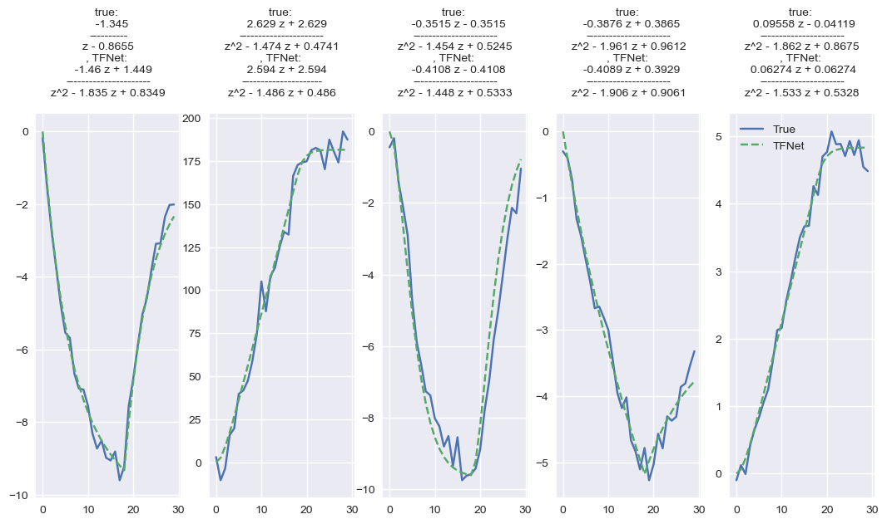

# TFNet: Few-Shot Identification of LTI Systems Based On Convolutional Neural Networks

This is the python implementation of the paper ["TFNet: Few-Shot 
Identification of LTI Systems Based On
Convolutional Neural Networks"](https://doi.org/10.1016/j.jprocont.2023.103034).

TFNet takes the first 30 samples from the response of the system to an 18-sample long pulse
and identifies the structure and parameters of the system's
transfer function model. 

As long as the system order is less than third and the sampling frequency
is greater than ten times the fastest frequency component of the system,
TFNet can robustly identify the system.

<p align="center">

</p>

## Installation

To install TFNet locally, clone this repository and run:

```bash
git clone https://github.com/abbasnosrat/TFNet.git
cd TFNet
pip install -r requirements.txt
pip install -e setup.py
```
    
## Usage/Examples
Basicusage of TFNet is:
```python
from TFNet.TFNet import TFNet

tfnet = TFNet()
identified_system = tfnet(system_response)
```
for more details, check "example.ipynb"

## License

[MIT](https://choosealicense.com/licenses/mit/)


## Author

- [@abbasnosrat](https://www.github.com/abbasnosrat)

